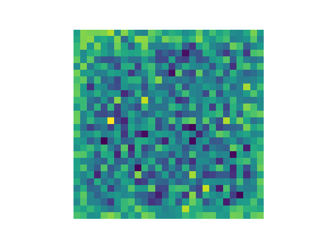
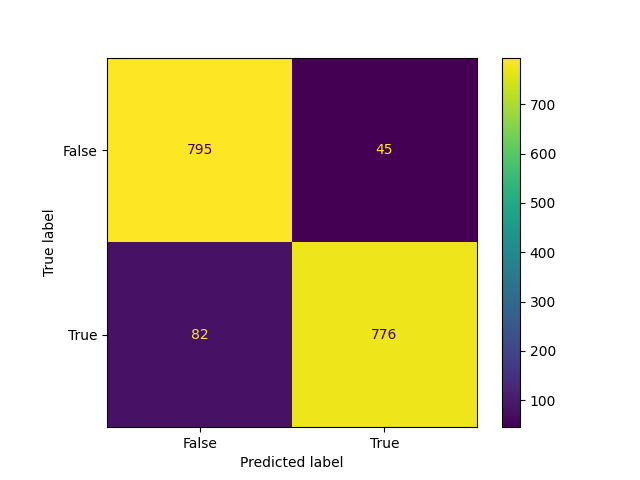
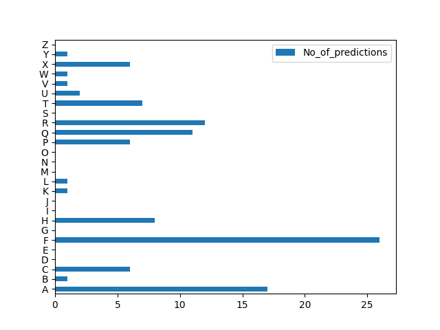

# Perceptron-python
Perceptronul este o rețea de neuroni artificiali bazată pe principiul de învățare supervizată. Acesta poate fi folosit pentru clasificarea datelor, inclusiv pentru recunoașterea obiectelor și a imaginilor. Perceptronul ia în considerare un set de date de intrare și încearcă să le îmbine într-un mod care produce cea mai optimă clasificare.
Acesta poate fi folosit pentru a rezolva probleme de optimizare complexe și poate fi folosit în aplicații cum ar fi recunoașterea vorbirii, recunoașterea imagine și prognozarea afacerilor.


 
## Code Review main.py

### Perceptron class:

---------------------
```python

class Perceptron:
    def __init__(
        self,
        *,
        letter: str = Literal['None'],
        learning_rate: float = 0.01,
        epochs: int = 50,
    ):
        self.bias = None
        self.weights = None
        self.letter: str = letter
        self.learning_rate: float = learning_rate
        self.epochs: int = epochs
        self.predictions: np.ndarray = np.random.rand(1)

    def __enter__(self):
        self.start_time = time()
        return self

    def __exit__(
        self,
        exc_type: Optional[BE],
        exc: Optional[BE],
        traceback: Optional[TracebackType],
    ) -> None:
        end_time = time() - self.start_time
        log.info('Took %s seconds', end_time)

    def train(self, X, y) -> None:
        self.weights: np.ndarray = np.random.rand(X.shape[1])
        self.bias: float = 0.0

        for _ in range(self.epochs):
            for i in range(X.shape[0]):
                y_pred = self.predict(X[i])
                self.predictions += y_pred
                error = y[i] - y_pred
                self.weights += self.learning_rate * error * X[i]
                self.bias += self.learning_rate * error

    def predict(self, array: np.ndarray) -> np.ndarray:
        y_pred = np.dot(array, self.weights) + self.bias
        return np.where(y_pred > 0, 1, 0)


```

Acest cod defineste o clasa Perceptron care poate fi utilizata pentru a antrena un model de perceptron. Un perceptron este un algoritm simplu de invatare automata folosit in clasificare binara.

Clasa Perceptron are mai multe metode:

 - init: metoda de initializare a clasei care seteaza valori default pentru proprietatile letter, lr (learning rate), epochs, weights, bias, predictions.
 - train: metoda de antrenare a modelului care primeste datele de antrenare X si etichetele y. Initializeaza ponderile si bias-ul cu valori aleatoare. Antreneaza modelul prin repetarea unui numar de epochs si ajustarea ponderilor si a bias-ului in functie de eroarea intre predictia facuta si eticheta reala.
 - predict: metoda de predictie care primeste datele de test x si returneaza o predictie binara (1 sau 0) bazata pe dot product intre ponderi si datele de test plus bias.

### Main:

---------------------


Acest main reprezinta un script de antrenare si testare a unui model de perceptron.


 - In primul rand, se seteaza modul in care datele sunt afisate in log (data, nivelul log-ului si formatul).

```python
logging.basicConfig(
    level=logging.INFO,
    format='[%(asctime)s] %(levelname)s: %(message)s',
    datefmt="%Y-%m-%d %H:%M:%S",
)
log = logging.getLogger(__name__)
```

 - Se citesc datele de antrenare din fisierul csv 'letters/emnist-letters-train.csv' si se prelucreaza doar datele cu eticheta 1 sau 2, convertindu-le in 0 sau 1.

```python
data_train = pd.read_csv('letters/emnist-letters-train.csv', header=None)
# Take only data with labels 0
letter_a = data_train[data_train.iloc[:, 0] == 1]
letter_a.iloc[:, 0] = 0
letter_b = data_train[data_train.iloc[:, 0] == 2]
letter_b.iloc[:, 0] = 1

data = pd.concat([letter_a, letter_b])
```

 - Se impart datele in set de antrenare si set de testare.

```python
train_data, test_data = train_test_split(data, test_size=0.25, random_state=1, shuffle=True)
```

 - Se separa datele in caracteristici si etichete. Caracteristicile sunt stocate in x_train si x_test, iar etichetele sunt stocate in y_train si y_test.

```python
x_train = train_data.drop(train_data.columns[0], axis=1).to_numpy()
x_test = test_data.drop(test_data.columns[0], axis=1).to_numpy()
y_train = train_data.iloc[:, 0].to_numpy()
y_test = test_data.iloc[:, 0].to_numpy()
```

 - Se rescaleaza datele de intrare intre 0 si 1.

```python
x_train = x_train / 255.0
x_test = x_test / 255.0
```

 - Se antreneaza modelul de perceptron cu datele de antrenare.

```python
P.train(x_train, y_train)
```

 - Se afiseaza ponderile modeului dupa antrenare.

```python
plt.imshow(np.resize(P.weights, (28, 28)))
plt.axis('off')
plt.show()
```

 - Se fac predictiile pentru datele de testare si se afiseaza un raport cu precizia si recall-ul modelului.

```python
log.info('Starting predictions....')
prediction = P.predict(x_test)
log.info('Prediction is done, dataset was successfully classified.\nReport:\n')
report = classification_report(prediction, y_test, digits=6)
log.info(report)
```

 - Se afiseaza si o matrice de confuzie pentru a intelege cum a fost clasificat fiecare punct din setul de testare.

```python
cm = confusion_matrix(y_test, prediction)

cm_display = metrics.ConfusionMatrixDisplay(
    confusion_matrix=cm, display_labels=[False, True]
)
cm_display.plot()
plt.show()
```


Asadar rezultatul rularii acestui program va fi:
```commandline
[2023-01-30 20:36:32] INFO: Starting training, this may take a while......
[2023-01-30 20:36:43] INFO: Training is done...
[2023-01-30 20:36:43] INFO: Starting predictions....
[2023-01-30 20:36:43] INFO: Prediction is done, dataset was successfully classified.
Report:

[2023-01-30 20:36:43] INFO:               precision    recall  f1-score   support

           0   0.946429  0.906499  0.926034       877
           1   0.904429  0.945189  0.924360       821

    accuracy                       0.925206      1698
   macro avg   0.925429  0.925844  0.925197      1698
weighted avg   0.926121  0.925206  0.925224      1698

[2023-01-30 20:36:43] INFO: Displaying confusion matrix...
[2023-01-30 20:36:43] INFO: Took 13.978129148483276 seconds
```

Iar ploturile vor fi afisate in felul urmator:  




## Code Review Perceptron_all_char.py

In aceasta varianta a codului a vrut sa se demostreze cum mai multi perceptroni sunt capabili sa se antreneze pe un singur caracter, incercand, asadar sa faca o predictie ulterioara pe un caracter nou.

----

Pentru fiecare literă din alfabetul englezesc (A-Z), se crează un obiect Perceptron, se setează un număr de 100 de epoci și o rata de învățare de 0,01, se preprocesează datele de antrenare prin normalizare (dividerea fiecărei valori cu 255), și se antrenează modelul folosind aceaste date de antrenare. După antrenare, se afișează imaginea greutăților modelului. Toate modelele antrenate sunt apoi adăugate într-o listă de perceptroni.

Apoi, se folosesc toate modelele antrenate pentru a face predicții cu privire la o imagine de testare de literă "F". Se utilizează 30 astfel de imagini de testare și fiecare model de perceptron face o predicție pentru fiecare imagine. Rezultatele predicțiilor sunt colectate într-un dataframe care ține evidența câte predicții pentru fiecare literă au fost făcute. La final, se calculează accuracy-ul modelului prin compararea cu rezultatele așteptate (câte imagini "F" au fost identificate corect).

În final, se afișează un grafic cu numărul total de predicții pentru fiecare literă și se afișează accuracy-ul modelului.

Output:

```commandline
Starting training for letter A, index 1
Starting training for letter B, index 2
Starting training for letter C, index 3
Starting training for letter D, index 4
Starting training for letter E, index 5
Starting training for letter F, index 6
Starting training for letter G, index 7
Starting training for letter H, index 8
Starting training for letter I, index 9
Starting training for letter J, index 10
Starting training for letter K, index 11
Starting training for letter L, index 12
Starting training for letter M, index 13
Starting training for letter N, index 14
Starting training for letter O, index 15
Starting training for letter P, index 16
Starting training for letter Q, index 17
Starting training for letter R, index 18
Starting training for letter S, index 19
Starting training for letter T, index 20
Starting training for letter U, index 21
Starting training for letter V, index 22
Starting training for letter W, index 23
Starting training for letter X, index 24
Starting training for letter Y, index 25
Starting training for letter Z, index 26
The perceptron have an accuracy of 0.3076923076923077 out of 30 samples!
```



